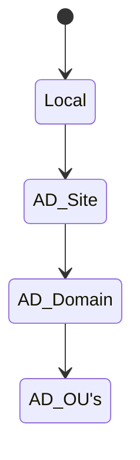

# Group Policy Order

## Local to OU

As a general rule of thumb, you have to remember the following order in which GPOs are applied. They are applied First to Last:
1. Local
2. Active Directory Site
3. Active Directory Domain
4. Active Directory OU (Any many more underneath if there are a handful of OUs)

